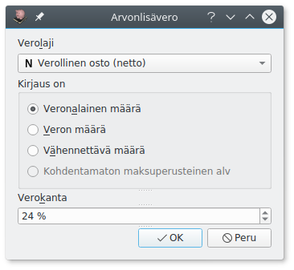

# Arvonlisävero

!!! info ""
    [Verohallinnon ohje arvonlisäverotuksesta](https://www.vero.fi/yritykset-ja-yhteisot/tietoa-yritysverotuksesta/arvonlisaverotus/)

!!! tip "Arvonlisäverovelvollisuus"
    Arvonlisäverovelvolliseksi on hakeuduttava, jos tilikauden liikevaihto voi ylittää 10 000 euroa. Alarajahuojennuksen takia hakeutuminen kannattaa yleensä pienemmälläkin liikevaihdolla. Yleishyödyllinen toiminta on arvonlisäverotonta, eli useimpien yhdistysten tarvitsee maksaa arvonlisäveroa vain, jos ne harjoittavat huomattavaa liiketoimintaa.

## Määritykset

Kirjanpitovelvollinen määritellään arvonlisäverovelvolliseksi **Perusvalinnoista**. Jos yritys ei ole alv-velvollinen, ei arvonlisäveroon liittyviä valintoja näytetä kirjauksissa eikä määrityksissä.

**Verokausi** on pääasiallisesti kuukausi. [Verohallinnon ohje](https://www.vero.fi/yritykset-ja-yhteisot/ilmoittaminen-ja-maksaminen/omaaloitteiset-verot/hakeutuminen_valinnaiseen_verokautee/) selvittää, milloin ja miten yritys voi hakeutus neljännesvuoden tai vuoden verokauteen.

**Viimeisin ilmoitus**-kohtaan merkitään se päivämäärä, johon asti arvonlisäveroilmoitukset on annettu.

Tällä sivulla voit myös tehdä uuden alv-tilityksen (**Tee alv-tilitys**) tai tarkastella jo tehtyjä tilityksiä (**Näytä tilitys** ja **Näytä erittely**)

## Arvonlisäverolajit

Kitupiikki käsittelee arvonlisäveroa ohjaustietojen avulla, eli samalle kirjanpitotilille voi kirjata erilaisen alv-kohtelun kirjauksia. Kirjaamisen helpottamiseksi voit toki luoda eri kirjanpitotilit esimerkiksi elintarvikkeiden myynnille (alv 14%) ja muulle myynnille.

Kitupiikissä on seuraavat alv-kirjaustyypit

 Tunnus         | Nimi    | Selitys
----------------|---------|---------
 | Veroton | Myynnistä ei makseta veroa / menosta ei tehdä alv-vähennystä. Tämä merkitään myös kaikille niille menotileille, jotka eivät ole alv-vähennyskelpoisia.
  | Verollinen myynti/osto (netto) | Verollinen kotimaan myynti/osto. Heti kirjauksen yhteydessä myynti- tai ostotilille kirjataan veroton määrä, ja alv-veron tai vähennyksen osuus kirjataan alv-velkojen tai -saatavien tilille.
  | Verollinen myynti/osto (brutto) | Verollinen bruttosumma kirjataan tilille, ja vero erotetaan tililtä alv-velkatilille vasta arvonlisäveroilmoitusta laadittaessa.
  | Verollinen myynti/osto (maksuperusteinen alv) | Arvonlisävero tilitetään vasta, kun maksu on suoritettu.
  | Nollaverokannan alainen myynti | [Erikseen määritellyt tilanteet](https://www.edilex.fi/verohallinnon_ohjeet/2014_0627.html#4.2 Nollaverokannan alaiset myynnit ja yritysj%C3%A4rjestelyt), joissa myynnistä ei suorita veroa, mutta hankinnoista saa vähentää arvonlisäveron.
  | Tavaroiden ja palveluiden yhteisömyynti | [Verohallinnon ohje](https://www.vero.fi/yritykset-ja-yhteisot/tietoa-yritysverotuksesta/arvonlisaverotus/ulkomaankaupan_arvonlisaverotus/).  Kirjauksen voi tehdä Kirjausapurilla.
  | Tavaroiden maahantuonti EU:n ulkopuolelta | [Maahantuonnin arvonlisävero](https://www.vero.fi/yritykset-ja-yhteisot/tietoa-yritysverotuksesta/arvonlisaverotus/ulkomaankaupan_arvonlisaverotus/maahantuonnin-arvonlisavero/) ilmoitetaan kausiveroilmoituksessa. Myyntilaskun yhteydessä kirjaus tehdään valinnalla **Tavaroiden maahantuonti EU:n ulkopuolelta**. Jos myyntilasku on jo kirjattu verottomana, voidaan tullauspäätös kirjata myöhemmin valinnalla **Tavaroiden maahantuonti, veron kirjaus**.
 | Rakennuspalveluiden myynti tai osto | [Rakennuspalveluiden arvonlisäveron suorittaa ostaja](https://www.vero.fi/yritykset-ja-yhteisot/tietoa-yritysverotuksesta/arvonlisaverotus/rakennusalan_kaannetty_arvonlisaverovelvollisuus/) käänteisen verovelvollisuuden mukaisesti. Kirjauksen voi tehdä Kirjausapurilla ja Kitupiikillä voi myös laatia laskun (mainittava ostajan Y-tunnus tai VAT-tunnus).

## Verolliset kirjaukset

Arvonlisäverolliset kirjaukset on helpointa tehdä [Kirjausapurilla](/kirjaus/apuri), joka jakaa myös nettokirjaukset tulos- ja alv-tileille. Myös laskutuksessa alv-kirjautuu automaattisesti valinnan mukaan.

[Ilman avustajaa](/kirjaus/kasin) kirjattaessa verolaji ja -prosentti on valittava erikseen.

* **Veronalainen määrä** tarkoittaa arvonlisäveron perustetta. Bruttokirjauksessa summa kirjataan alv-tiedolla *Verollinen myynti(brutto)* ja *veronalainen määrä*. Nettokirjauksessa tähän kirjataan veroton (netto)summa.
* **Veron määrä** tarkoittaa maksettavaa arvonlisäveroa: nettokirjauksessa tähän kirjataan maksettava vero eli brutto- ja nettosummien erotus.
* **Vähennettävä määrä** tarkoittaa ostojen kirjauksessa arvonlisäverosta vähennettävää määrää.
* **Kohdentamaton maksuperusteinen alv** tarkoittaa maksua odottavaa veroa

!!! warning "Koodit kohdalleen"
    Arvonlisäveron käsittely perustuu kirjauksiin liittyviin ohjaustietoihin. Väärät alv-koodit johtavat virheelliseen alv-ilmoitukseen. Jotta ohjaustiedot tulevat oikein, on verolliset kirjaukset suositeltavaa tehdä Kirjausapurilla aina kuin se vain on mahdollista!

## Arvonlisäverolaskelma

Kitupiikki muistuttaa aloitusikkunassa, kun arvonlisäveroilmoituksen eräpäivä lähestyy

Kun kaikki tälle ilmoituskaudelle tehdyt verolliset kirjaukset on tehty, paina *Arvonlisävero*-sivulla **Tee alv-tilitys**-nappia.

Kitupiikki esittää Alv-laskelman, jossa on kausiveroilmoituksessa arvolisäveron osalta tarvittavat tiedot. Vahvista laskelma painamalla **OK**.

Laskelman pohjalta tehdään kirjaus, jossa alv-velka ja alv-saatava yhdistetään ja kirjataan **Verovelat**-tilille. Samalle tilille tulee kirjata myös muut oma-aloitteisesti maksettavat verot, kuten ennakonpidätys ja työnantajamaksut.

!!! note "Verovelat-tili"
    Verovelat-tilille kirjataan kaikki oma-aloitteiset verot, jotka on ilmoitettu verottajalle mutta ei vielä maksettu. Näin Verovelat-tilin saldon pitäisi aina vastata OmaVeron maksamattomien verojen saldoa.

Erittely, jossa kirjauksia voi seurata aina tositteisiin saakka, avautuu alv-sivun **Näytä erittely**-napista. Se tallentuu myös liitteeksi alv-tilitysvientiin ja siten myös sähköiseen arkistoon.

!!! tip "Arvonlisäverolaskelma kesken kauden"
    Tulosteet-välilehdeltä voit tulostaa Alv-erittelyn haluamaltasi aikaväliltä.

## Maksuperusteinen arvonlisävero

!!! info ""
    [Verohallinnon ohje maksuperusteisesta arvonlisäverosta](https://www.vero.fi/yritykset-ja-yhteisot/tietoa-yritysverotuksesta/arvonlisaverotus/pienyritykset_voivat_tilittaa_arvonlisa/)

Pienyritykset (liikevaihto alle 500 000 euroa vuodessa) voivat tilittää ostojen ja myyntien arvonlisäverot maksuperusteisesti. Kitupiikillä tämä on mahdollista myös niin, että kirjanpito pidetään suoriteperusteisena.

Kun yritys saa ostolaskun, kirjataan arvonlisäveron osuus tilille **Maksuperusteinen alv-velka**. Kun arvonlisäverosta saadaan maksu, siirretään veron osuus tilille **Arvonlisäverovelka** ja vasta nyt vero tulee näkyviin alv-tilitykseen.

Vastaavalla tavalla ostolaskun veron osuus kirjataan ensin tilille **Maksuperusteinen alv-saaminen** ja vasta kun lasku on maksettu, se siirtyy tilille **Arvonlisäverosaatavat**.

Arvonlisävero on kuitenkin maksettava viimeistään vuoden kuluttua suoritepäivästä.

Kun verolajina on maksuperusteinen arvonlisävero, käsittelee Kitupiikki sen automaattisesti laskutuksessa, Kirjausapurissa sekä tuoduissa myyntilaskuissa ja tilitapahtumiin perustuvissa maksukirjauksissa. Käsittely perustuu ohjaustietoihin ja alv-koodeihin.

Maksuperusteinen arvonlisävero otetaan käyttöön Arvonlisäveron määrityksistä **Maksuperusteinen alv**-rivillä olevasta rataspainikkeesta, josta aukeaa valintaikkuna:

**Maksuperusteinen arvonlisäverotus alkaa**-ruutuun kirjataan sen verokauden ensimmäinen päivä, jonka arvonlisävero tilitetään maksuperusteisena.

Jos maksuperusteisesta arvonlisäverotuksesta siirrytään takaisin suoriteperusteiseen, merkitään **Suoriteperusteiseen arvonlisäveroon palataan**-ruutuun sen verokauden ensimmäinen päivä, jolloin arvonlisävero tilitetään normaalilla tavalla. Tässä alv-tilityksessä maksetaan myös kaikki vielä maksamatta oleva maksuperusteinen arvonlisävero.

!!! note "Tutustu huolella verohallinnon ohjeisiin"
    Ennen maksuperusteiseen arvonlisäverotukseen siirtymistä tutustu huolella verohallinnon ohjeisiin. Huomaa, että myös alv-vähennykset tilitetään maksuperusteisesti (myös osamaksua käytettäessä).
